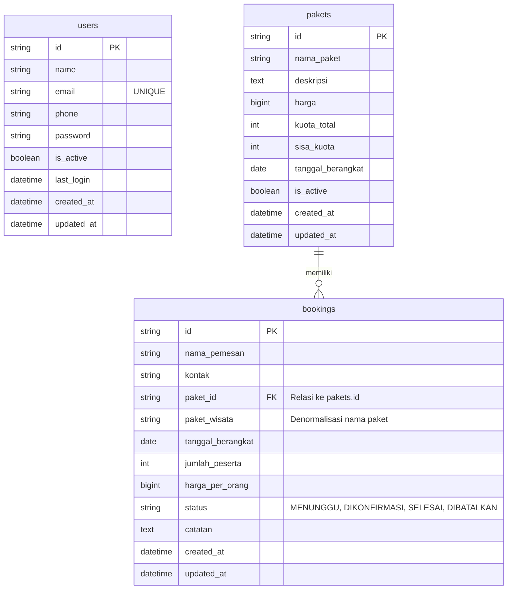

# 🌴 TravelKu - Modul Manajemen Pemesanan (Booking)

Halo! Selamat datang di **TravelKu** 👋 Ini adalah sistem manajemen internal untuk agen perjalanan (*Travel Agent*) yang berfokus ke **Modul Manajemen Pemesanan (Booking)**. 

Proyek ini dibuat untuk menjawab kebutuhan modul booking secara menyeluruh—mulai dari tampilan web (Frontend), logika server (Backend), sampai penyimpanan (Database). Semuanya dirancang rapi pake pendekatan *Clean Architecture*, tampilan responsif yang memanjakan mata, serta validasi super aman biar data nggak ngaco!

---

## 🚀 Cara Nge-run Project di Komputer Kamu

Aplikasi ini menggunakan struktur monorepo biar rapi, memisahkan folder `backend` (Go) dan `frontend` (Vue.js + Vite). Sebelum mulai, pastikan komputer kamu sudah terpasang **Go (1.20+)**, **Node.js (18+)**, dan **PostgreSQL** ya!

### 1. Nyalakan Backend (Go)
1. Buka terminal kamu, lalu masuk ke folder backend:
   ```bash
   cd backend
   ```
2. Salin file konfigurasi environment-nya:
   ```bash
   cp .env.example .env
   ```
   *(Jangan lupa sesuaikan setingan `DB_*` di file `.env` dengan kredensial database PostgreSQL lokal kamu ya)*.
3. Unduh semua modul yang dibutuhkan:
   ```bash
   go mod tidy
   ```
4. Jalankan server backend-nya (di sini kita dukung [Air](https://github.com/cosmtrek/air) biar bisa otomatis *auto-reload* pas kode diubah):
   ```bash
   go run cmd/api/main.go
   ```
   *(Server bakal jalan di port `http://localhost:8080` dan otomatis bikin tabel ke database kamu)*.
5. **Dokumentasi API (Swagger)** bisa kamu coba langsung secara interaktif di:
   👉 `http://localhost:8080/swagger/index.html`

### 2. Nyalakan Frontend (Vue.js + Vite)
1. Buka tab/jendela terminal baru, lalu masuk ke folder frontend:
   ```bash
   cd frontend
   ```
2. Pasang semua paket dependensinya:
   ```bash
   npm install
   ```
3. Jalankan server development-nya:
   ```bash
   npm run dev
   ```
   *(Tampilan web bakal jalan di `http://localhost:5173`)*.
4. Buka `http://localhost:5173` di browser kamu, dan sistem siap dicoba!

---

## 💻 Tech Stack & Alasan di Balik Layar

### Sisi Frontend (Tampilan)
* **Vue 3 (Composition API) & Vite**: Kombinasi maut buat bikin web super kencang, *hot-reload* instan, dan struktur kodenya gampang banget dipahami.
* **Vue Router**: Mengatur perpindahan halaman secara mulus (*Single Page Application*) dan dilengkapi proteksi halaman (Route Guard) biar halaman admin nggak bisa diintip sebelum login.
* **Axios**: Library andalan buat kirim-terima data dari API backend.
* **Vanilla CSS (Desain Eksklusif)**: Kita sengaja bikin CSS manual tanpa framework instan (seperti Tailwind) biar tampilannya berkarakter, eksklusif, responsif, dan bebas dari *bloatware* CSS yang berat.

### Sisi Backend (Logika & Data)
* **Golang (Go)**: Terkenal sangat cepat, hemat memori, dan handal banget pas menangani banyak transaksi booking secara bersamaan.
* **Gin Framework**: Router HTTP paling ngebut di ekosistem Go, bikin API kita responsif banget.
* **GORM**: ORM paling populer buat Go, ngebantu kita migrasi tabel otomatis dan bikin query pencarian/filter jadi simpel banget tanpa ribet nulis SQL manual.
* **PostgreSQL**: Database tangguh standar industri untuk menjamin data transaksi tersimpan aman tanpa duplikasi (*ACID compliant*).
* **Swaggo (Swagger)**: Bikin dokumentasi API otomatis dari komentar kode, biar tim frontend atau reviewer bisa nyobain API-nya langsung tanpa repot pasang Postman.

---

## 🎯 Fitur yang Udah Selesai (100% Beres!)

### Fitur Wajib (Must-Have) - ✅ Selesai Lengkap
- [x] **Tambah Pemesanan Baru**: Inputnya lengkap, bisa langsung kalkulasi harga total, dan otomatis berstatus "Menunggu".
- [x] **Daftar Pemesanan**: Menampilkan list booking terurut (yang paling baru daftar langsung muncul di paling atas).
- [x] **Edit & Hapus Pemesanan**: Dilengkapi pengunci otomatis (booking yang statusnya udah *Selesai* atau *Dibatalkan* nggak bakal bisa diubah-ubah lagi demi keamanan data keuangan).
- [x] **Alur Status Booking (Workflow)**: Perpindahan status yang logis dan aman (Menunggu → Dikonfirmasi / Dibatalkan; Dikonfirmasi → Selesai / Dibatalkan).
- [x] **Filter Berlapis**: Bisa cari booking secara *real-time* berdasarkan Status, Nama Paket Wisata, dan Rentang Tanggal Keberangkatan sekaligus.
- [x] **Kotak Ringkasan (Summary)**: Menampilkan total booking dan estimasi pendapatan bersih secara dinamis (hanya menghitung yang berstatus *Dikonfirmasi* dan *Selesai*), otomatis ter-update pas kamu ganti filter.
- [x] **Validasi Sisi Server**: Proteksi ketat biar nggak ada data aneh masuk (jumlah peserta minimal 1, harga nggak minus, tanggal berangkat nggak boleh di masa lalu, dan kontak jemaah wajib diisi).

### Fitur Bonus (Biar Makin Keren!) - 🚀 Udah Beres Juga!
- [x] **Tabel Paket Wisata Terpisah (Relasi DB)**: Paket wisata ditarik langsung dari database, jadi staf tinggal pilih paketnya lewat dropdown (nggak ketik manual lagi).
- [x] **Validasi Sisa Kuota Paket**: Sistem otomatis memotong kuota dan bakal menolak booking baru kalau kuota paket wisatanya udah habis.
- [x] **Pencarian Nama & Kontak**: Bisa langsung cari nama pemesan atau nomor teleponnya lewat bar pencarian.
- [x] **Desain Mobile Friendly**: Layout responsif, pake *Sidebar* di layar komputer dan *Bottom Navbar* ala aplikasi kekinian di layar handphone.
- [x] **Autentikasi Staf (Login)**: Proteksi token JWT, bikin API aman dari akses luar dan ada halaman login adminnya.
- [x] **Dokumentasi API Interaktif (Swagger UI)**: Dilengkapi dengan Swagger UI (`/swagger/index.html`) interaktif yang komprehensif, mencakup dokumentasi skema request/response, penanganan error validasi, dan otorisasi Bearer Token JWT. Ini memudahkan frontend developer atau reviewer untuk langsung mencoba, memverifikasi, dan bereksperimen dengan seluruh endpoint API secara aman di browser tanpa harus mengandalkan Postman atau tools eksternal lainnya!
- [x] **Pagination (Pagenasi Halaman)**: Tabel booking dilengkapi pagenasi dinamis sisi server (menerima parameter `page` dan `limit` dari query) lengkap dengan tombol navigasi, total data, dan indikator halaman aktif yang interaktif.
- [ ] *Ekspor data booking ke file CSV*.

---

## 📊 Rancangan Database (ERD)

Tabel `pakets` dan `bookings` terhubung dengan relasi satu-ke-banyak (*One-to-Many*). Setiap kali ada booking baru, sistem bakal memverifikasi kuota di tabel `pakets` dan mengikat `paket_id`.



---

## 🧠 Alasan di Balik Keputusan Teknis & Asumsi

1. **Pakai Clean & Modular Architecture di Go**:
   Saya menggunakan clean architecture kode backend dipisah per domain (`auth`, `booking`, `packs`, `user`). Masing-masing domain punya pemisahan tugas yang jelas antara `Controller` (urusan HTTP), `Service` (urusan logika bisnis), dan `Repository` (urusan query database). Kode jadi rapi , gampang dibaca, dan gampang kalau mau ditambah fitur baru.
2. **Kunci Status yang Udah Selesai (*Terminal State*)**:
   Demi keamanan data, booking yang statusnya sudah `SELESAI` atau `DIBATALKAN` nggak boleh diotak-atik lagi. Aturan ini dikunci mati di model backend (`IsTerminal()`) biar nggak ada celah manipulasi data historis keuangan.
3. **Pengecekan Kuota Ganda**:
   Pengecekan sisa kuota dilakukan dua kali: di tampilan frontend secara reaktif (buat kasih peringatan instan ke staf) dan di backend secara transaksional database (buat jaga-jaga kalau ada dua staf booking di detik yang sama).
4. **Token JWT untuk Keamanan**:
   Semua aksi manipulasi data harus melampirkan Token JWT di header. Kalau nggak login dulu, request otomatis ditolak sama middleware keamanan kita.
5. **Dokumentasi Swagger UI untuk Tracking & Testing**:
   Daripada repot membuat koleksi Postman secara manual satu per satu dari awal—yang rawan usang dan tidak sinkron saat ada perubahan kode—saya memutuskan menggunakan Swagger UI. Ini mempermudah tracking, dokumentasi skema request/response, dan pengujian API secara instan. Bahkan, berkas Swagger JSON-nya bisa langsung di-import ke Postman sekali klik jika ingin melakukan testing lanjutan di sana!

---

## 🛠️ Rencana Upgrade (Kalau Punya Waktu Lebih)

1. **Unit Test & Integration Test**: Bikin tes otomatis pake package bawaan Go buat ngetes logika pemotongan kuota dan alur transisi status booking biar makin mantap.
2. **Fitur Ekspor laporan**: Bikin tombol sekali klik buat download semua data booking ke format CSV atau PDF biar bagian akuntansi/keuangan makin terbantu.
3. **Hak Akses Khusus (RBAC)**: Membagi peran user, misalnya ada *Super Admin* (bisa kelola akun staf) dan *Staf Biasa* (hanya bisa kelola booking).
